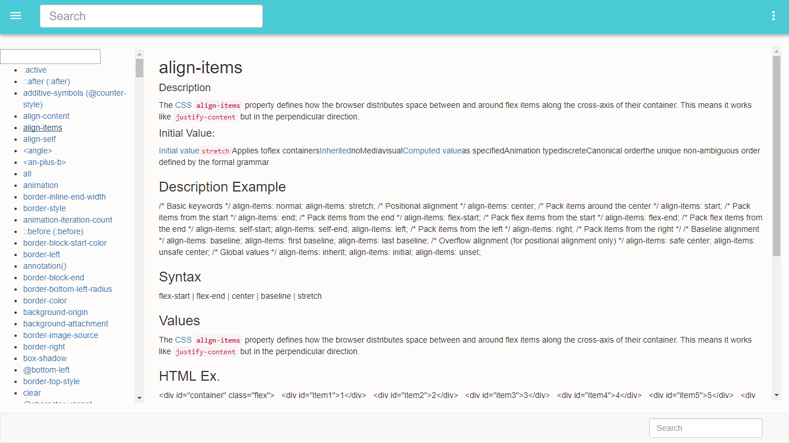
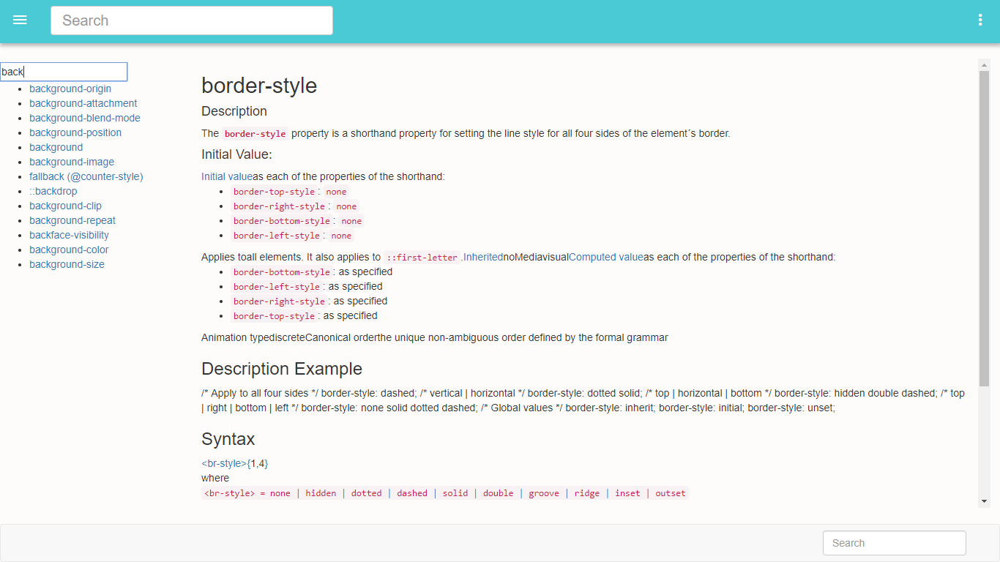

        

            <h3>Technologies Used</h3>

            <h4>Frontend</h5>
            

                1> Bootstrap [For designing]  
                2> jquery  
                3> Angular [To make web app single page and fast]
            

             
            <h4>Backend</h5>
            

                1> Nodejs
                2> MongoDB
            

            
        

      

    
         
    
